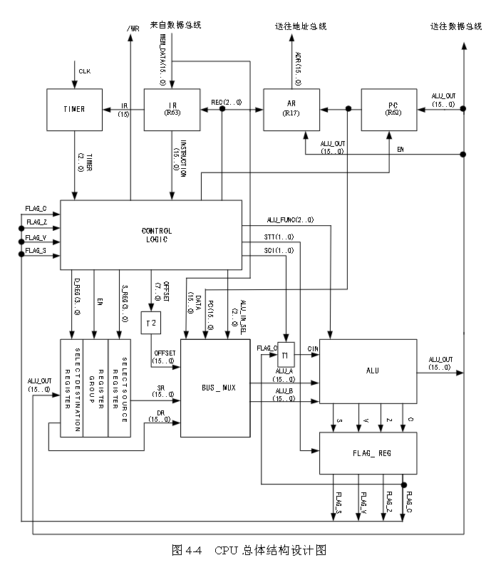

# cpu-verilog

FPGA模拟CPU组成并实现自定义指令集

## 指令集介绍

| 指令   | 指令二进制码               | 功能介绍        |
| ---- | -------------------- | ----------- |
| ADD  | 8'b00000000          | 加运算         |
| SUB  | 8'b00000001          | 减运算         |
| AND  | 8'b00000010          | 与运算         |
| CMP  | 8'b00000011          | 比较          |
| XOR  | 8'b00000100          | 异或          |
| TEST | 8'b00000101          | test指令      |
| OR   | 8'b00000110          | 或运算         |
| MVRR | 8'b00000111          | mov指令       |
| DEC  | 8'b00001000          | 寄存器减一       |
| INC  | 8'b00001001          | 寄存器加一       |
| SHL  | 8'b00001010          | 逻辑左移立即数     |
| SHR  | 8'b00001011          | 逻辑右移立即数     |
| ADC  | 8'b00001100          | 带进位加法       |
| SBB  | 8'b00001101          | 借位减法        |
| JR   | 8'b01000000          | 跳转          |
| JRC  | 8'b01000100          | C=1时跳转      |
| JRNC | 8'b01000101          | C=0时跳转      |
| JRZ  | 8'b01000110          | Z=1时跳转      |
| JRNZ | 8'b01000111          | Z=0时跳转      |
| JRS  | 8'b01000001          | S=1时跳转      |
| JRNS | 8'b01000011          | S=0时跳转      |
| CLC  | 16'b0111100000000000 | 清除进位标志位C    |
| STC  | 16'b0111101000000000 | 将进位标志位C置1   |
| JMPA | 16'b1000000000000000 | 跳转立即数       |
| LDRR | 8'b10000010          | DR← [SR]    |
| STRR | 8'b10000011          | [DR]← SR    |
| MVRD | 8'b10000001          | mov指令立即数    |
| NOP  | 8'b11111111          | 空指令         |
| PUSH | 8'b10000100          | 入栈，r15作为栈指针 |
| POP  | 8'b10000101          | 出栈，r15作为栈指针 |
| ROL  | 8'b01100000          | 循环左移        |
| ROR  | 8'b01100001          | 循环右移        |
| NOT  | 8'b01100010          | 非运算         |
| ADDI | 8'b10100001          | 加法立即数       |
| SUBI | 8'b10100010          | 减法立即数       |
| ORI  | 8'b10100011          | 或运算立即数      |
| ANDI | 8'b10100100          | 与运算立即数      |
| XORI | 8'b10100101          | 异或运算立即数     |
| CMPI | 8'b10100110          | 比较立即数       |
